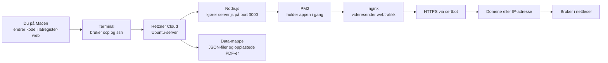
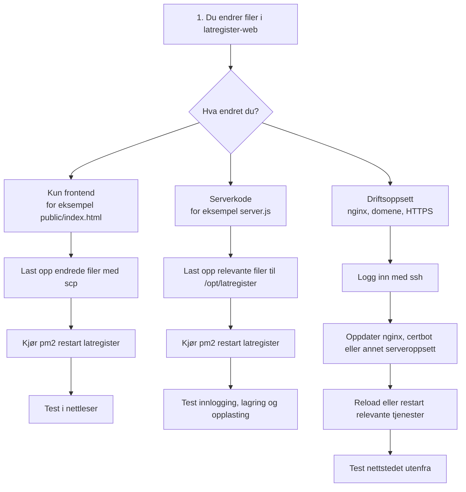

# Låtregister Web: Deployment-oversikt

Denne guiden beskriver bare web-versjonen av Låtregister: hva som er involvert i deployment, hvordan flyten ser ut, og hva du gjør etter at du har gjort endringer.

## Hurtig-guide

Hvis du bare vil vite hva du gjør etter en vanlig endring, er dette den korte versjonen:

### Hvis du har endret webgrensesnittet

Eksempel: `public/index.html`, `public/login.html` eller `public/graph.html`

1. Last opp de endrede filene til serveren med `scp`.
2. Kjør `pm2 restart latregister`.
3. Åpne nettstedet i nettleser og test at alt virker.

### Hvis du har endret serverkoden

Eksempel: `server.js`

1. Last opp de endrede filene til `/opt/latregister`.
2. Kjør `pm2 restart latregister`.
3. Test innlogging, lasting, lagring og opplasting.

### Hvis du har endret serveroppsett

Eksempel: `nginx`, domene eller HTTPS

1. Logg inn på serveren med `ssh`.
2. Oppdater oppsettet direkte på serveren.
3. Reload eller restart relevante tjenester.
4. Test nettstedet utenfra via vanlig adresse.

### Fast huskeregel

`Endre lokalt -> last opp -> restart ved behov -> test i nettleser`

## Oversikt



## Oversikt over løsningen

### Lokalt hos deg

- `latregister-web/`: her gjør du endringer i webappen.
- `Terminal`: brukes til opplasting og servertilgang.
- `scp`: brukes for å laste opp filer til serveren.
- `ssh`: brukes for å logge inn på serveren.

### På serveren

- `Hetzner`: der serveren kjører.
- `Ubuntu`: operativsystemet på serveren.
- `Node.js`: kjører `server.js`, altså webappen.
- `PM2`: holder appen oppe og starter den igjen etter omstart.
- `nginx`: tar imot trafikk fra nettet og sender den videre til appen på port `3000`.
- `certbot`: setter opp og fornyer HTTPS-sertifikat.

### For brukeren

- `Domene eller IP-adresse`: adressen brukeren går til.
- `Nettleser`: der Låtregister åpnes og brukes.

## Hva som skjer når du deployer



## Typiske endringer og hva du gjør

### Når du bare har endret frontend

Eksempel: du har endret `public/index.html`.

1. Last opp filen til serveren.
2. Restart appen i PM2.
3. Åpne nettstedet i nettleser og test.

Eksempelkommandoer:

```bash
scp ~/Downloads/latregister-web/public/index.html root@DIN_IP:/opt/latregister/public/
ssh root@DIN_IP
pm2 restart latregister
```

### Når du har endret serverkode

Eksempel: du har endret `server.js`.

1. Last opp endrede serverfiler til `/opt/latregister`.
2. Restart appen i PM2.
3. Test innlogging, datalasting, lagring og opplasting.

### Når du har endret drift eller oppsett

Eksempel: `nginx`, domene eller HTTPS.

1. Logg inn på serveren med `ssh`.
2. Oppdater oppsettet direkte på serveren.
3. Reload eller restart relevante tjenester.
4. Test nettstedet fra utsiden, helst via det vanlige domenet.

## Sjekkliste etter deploy

- Last opp riktige filer til serveren.
- Restart `latregister` i PM2 hvis endringen påvirker appen.
- Test at innlogging fungerer.
- Test at data lastes inn.
- Test at lagring fungerer.
- Test at PDF-er kan lastes opp og åpnes hvis endringen kan påvirke det.
- Test at HTTPS fungerer hvis dere bruker domene.

## Kort oppsummert

Web-versjonen av Låtregister deployes manuelt. Du gjør endringer lokalt, laster opp filer til Hetzner-serveren, restarter appen ved behov, og tester i nettleser. Node.js kjører selve appen, PM2 holder den i gang, nginx eksponerer den på web, og certbot sørger for HTTPS hvis dere bruker domene.

## Kilder i repoet

Denne oversikten er basert på:

- [BYGG.md](/Users/tellef/Claudeprosjekter/latregister-electron/BYGG.md)
- [latregister-web/OPPSETT.md](/Users/tellef/Claudeprosjekter/latregister-electron/latregister-web/OPPSETT.md)
- [latregister-web/server.js](/Users/tellef/Claudeprosjekter/latregister-electron/latregister-web/server.js)
